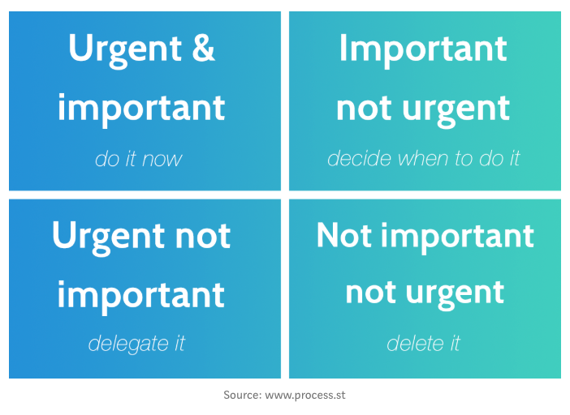

# Countdown

With Countdown, you see exactly how much time you have left to complete a
project/milestone.

## Features

### Sense of Urgency — Importance requiring swift action

Every minute and second that passed created a higher sense of urgency to get
that special milestone done. Countdown is a great compliment to the Urgency
Matrix.

With Countdown your tasks and projects will automatically jump from one quadrant
to the next. If you have quarterly reports that are due in a month, they fall in
the Important but not Urgent Quadrant but as the days and weeks pass, they move
into the Urgent and Important quadrant.
Setting the countdown ahead of time will allow you to keep track of this
movement and be prepared as the due date quickly approaches.

### Motivation — The general desire or willingness of someone to do something

No one wants to miss something important like your marathon time by 3 seconds or
the bus by 10 seconds. Knowing how much time is left to your goal time or making
the bus on time is pure motivation to get it done quicker or get there faster.
Why should your to dos be any different?

Combining that with the sense of urgency, you become _unstoppable_.
**3, 2, 1…your task is done.**

## Usage

### How to use?

In your browser (we recommend using Chrome), enter the following url:
https://countdown.loftorbital.com and sign in with your loftorbital account.
That's it.

### How to add or delete a Milestone?

Go to the Google Sheets to add or delete a milestone.
Note: future versions will support add/delete/modify directly from the Countdown
App. Stay tuned.

## Scripts

In the project directory, you can run:

### `npm install`

Installs dependencies

### `npm start`

Run the apps in the development mode.
Open [http://localhost:3000](http://localhost:3000) to view it in the browser.

The page will reload if you make edits.
You will also see any lint errors in the console.

### `npm run build`

Builds the app for production to the build folder.
It correctly bundles React in production mode and optimizes the build for the
best performance.

The build is minified and the filenames include the hashes.
Your app is ready to be deployed!

See the section about [deployment](https://facebook.github.io/create-react-app/docs/deployment) for more information.

## Tech/Framework used

This project:

- was bootstrapped with [Create React App](https://github.com/facebook/create-react-app)
- uses [Semantic UI React](https://react.semantic-ui.com/usage) for css styling
- works with the [Google Sheets Api](https://developers.google.com/sheets/api) to fetch data from a Google Sheets that contains Loft Orbital major milestones.

## Credits

Special thanks to zFunx for his [css background animation](https://www.youtube.com/watch?v=4UvWpjSRrm0), Florin Pop for his [tutorial](https://www.florin-pop.com/blog/2019/05/countdown-built-with-react/) about how to make a coutdown component with React and Sergiy Dybskiy for his [tutorial](https://blog.416serg.me/building-an-app-using-google-sheets-api-react-d69681d22ce1) to build a React App with Google Sheets API.
